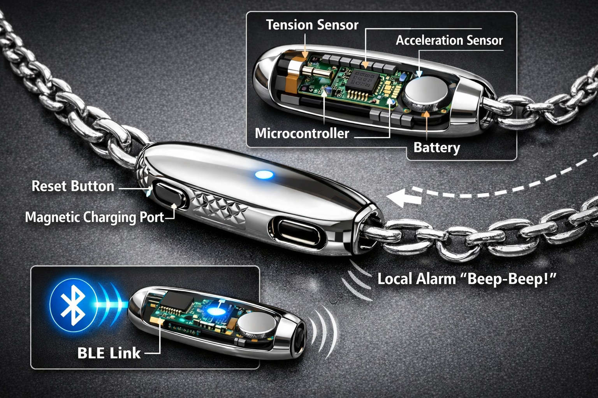

# SafeChain: Wearable anti-chain-snatch system analysis

## 1. Goal
- Create a small, jewelry-integrated extension element that detects a chain snatch (pull/pull force) and triggers an immediate alert.
- Prefer safety-first behavior: fast alert and safe release under force rather than forceful mechanical lock that could injure wearer.

## 2. Problem statement
- Target scenario: attacker pulls chain abruptly to snatch jewelry
- Requirements:
  - detect abnormal tension/acceleration quickly
  - low false positives from normal movements
  - physically compact and aesthetically acceptable
  - low power (battery-based), reliable operation
  - optional partner-device notification (BLE) and local alarm (beep/vibration)

## 3. Core sensing options
### a) Tension sensor approach
- Micro strain gauge / foil strain bridge in chain link extension. Measures extension/stretch when chain is pulled.
- Miniature load cell or micro force sensor (1	6 N range). Fits in small 3mart coupler.
- Mechanical contact-break trigger (failsafe): a small breakaway link opens at high force.

### b) Inertial approach
- MEMS accelerometer/gyro (e.g., BMI270, MPU-6500), detects jerk (sudden acceleration away from body).
- Use with a threshold-based algorithm, optionally combined with force signal to reduce false alarms.

### c) Dual-mode for reliability
- combine tension and jerk for high-confidence detection.

## 4. Electronics & power strategy
- energy source: small LiPo/Li-ion coin cell (20	660mAh), or rechargeable flat cell.
- MCU/SoC with BLE and low-power sleep (Nordic nRF52, TI CC2640R2, Ambiq Apollo).
- sensor interface: ADC for strain gauge, I2C/SPI for accelerometer.
- sound haptics: piezo buzzer or vibration motor for local alarm.
- communication: BLE advertising/notify for smartphone or partner device.

## 5. Safety note (critical)
- Avoid rigid 3prevent detachment mechanisms that apply opposing force and could hurt the user.
- Use safe design patterns:
  - breakaway weak link that releases under extreme pull, like sports lanyards
  - immediate alert + remote notification, not mechanical lock.

## 6. Feasibility and implementation path
1. Quick prototype: dev board + IMU + audio and test here.
2. Next step: custom compact PCB with strain sensor in housing + battery.
3. Final product: molded link extension; water-resistant; replaceable/rechargeable battery.

## 7. Known/related products
- anti-theft pendant alarms (mostly sound-only)
- smart bracelets/rings with fall/shock detection
- breakaway lanyards in sports gear (safety-first, not lock)

## 8. Risks and mitigations
- false positives: multi-sensor fusion + short alarm lock-out + user reset.
- battery drain: deep sleep + wake on interrupt + quarterly charge.
- sensor calibration: store thresholds by user and set alert envelope.

## 8.1. Visual reference

## 9. Next actions
- write requirements in detail: detection threshold, alarm behavior, runtime, size.
- prototype in near-term with off-the-shelf modules (Nordic dev kit + IMU).
- test with controlled pull-force rig to select safe breakaway thresholds.
- validate and document visual concept with image asset: `Pictures\\SafeChain.jpg` (Sora-generated). This image is relevant as a conceptual illustration of the wearable anti-chain-snatch form factor and user context.

## 10. Final recommendation
- Your device is practical and viable.
- Build around detection + alert, do not attempt active mechanical retention on the wearer.
- Safety must be: fast alert + safe release to avoid injury.

## 11. Glossary
- BLE: Bluetooth Low Energy, a wireless protocol optimized for low power and short-range communications used by many wearable devices.
- MCU: Microcontroller unit, the small computer that controls sensors, alarms, and communication.
- IMU: Inertial Measurement Unit, a sensor package that includes accelerometers/gyroscopes to detect movement.
- LiPo: Lithium Polymer battery, commonly used in compact wearables for energy storage.

